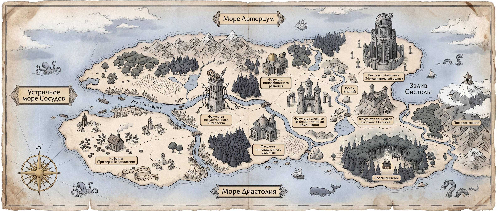

# Волшебная школа медицинских инноваций им. Асклепия

Интерактивная иллюстрированная карта-путешествие по факультетам волшебной медицинской школы. Образовательный продукт для врачей-кардиологов: 22 остановки с разными типами контента (видео, карточки, шпаргалки, мини-игра «зельеварение», квиз, диплом).

> [Pre-alpha]. Работает как single-page web-app: HTML + React (CDN) + Babel standalone. Не требует сборки — открывается через любой статический сервер.

## Превью



Старинная картография, факультетские здания вместо городов, золотые pin-метки в стиле Этерна (Кинопоиск), волшебник Тамаз ведёт игрока от остановки 1 до 22, копит баллы мудрости, в финале выдаёт диплом (бронзовый/серебряный/золотой).

## Запуск

Никакой сборки. Любой статический сервер из корня репозитория:

```bash
# Python
python3 -m http.server 8080

# или Node
npx serve .

# или VS Code Live Server
```

Открыть `http://localhost:8080/`.

> **Важно**: открывать через сервер, а не через `file://` — Babel standalone не сможет загрузить .jsx по file-протоколу.

## Структура

```
.
├── index.html              # точка входа, весь CSS встроен
├── public/
│   └── map-base.jpg        # карта 3168×1344 (1.1 MB)
├── src/
│   ├── app.jsx             # корневой компонент, pan/zoom, прогресс
│   ├── data.jsx            # 22 остановки, координаты, glyph-иконки, квиз
│   ├── map-canvas.jsx      # Pin, PathLine, TamazSprite, Clouds
│   ├── popups.jsx          # все 8 типов попапов
│   └── tweaks-panel.jsx    # дев-панель для настройки облаков и т.п.
└── docs/
    └── BUGFIX.md           # история поправки чёрного экрана при панорамировании
```

## Архитектура

### Стек
- **React 18** через CDN (unpkg)
- **Babel standalone** компилирует JSX в браузере
- **Локальное хранение прогресса** через `localStorage` (ключ `asclepius_progress_v2`)
- Никаких сторонних UI-библиотек, всё руками

### Pan/zoom
Карта — статичный JPEG 3168×1344, обёрнутый в `.map-world` div, который перемещается через `transform: translate3d(...) scale(...)`. Границы клампятся так, что край картинки = край мира (нельзя оттянуть за пустоту).

- `minScale` — `max(vp.h/MAP_H, vp.w/MAP_W)` — гарантирует, что карта всегда покрывает viewport
- `maxScale` — 2.4
- Drag через pointer events (с suppress-кликом-после-drag)
- Wheel-zoom через native non-passive listener (React-овский `onWheel` пассивный)

### Координаты пинов
Хранятся в `data.jsx` как `position: { x, y }` в **процентах** от размеров карты. При смене картинки или её ресайзе координаты пинов остаются валидными.

### Прогресс и баллы
- Открытие остановок 2–21 даёт +1 балл мудрости
- Стопы 1 (аватар) и 22 (диплом) баллы не дают
- Уровни диплома: 5–9 бронза · 10–14 серебро · 15–20 золото
- Состояние в `localStorage`, сброс через дев-панель

### Содержимое 22 остановок

Группировка по факультетам:

| № | Факультет / локация | Тип контента |
|---|---|---|
| 1 | Река Аватария | AI-генерация аватарки |
| 2–3 | Факультет инновационного развития (Демкина) | Видео + шпаргалка |
| 4–5 | Кофейня «Три зерна кардиологии» | Видео + заклинание «Элевато Максима» |
| 6–7 | Факультет ИИ (Демкина) | Стендап-видео + шпаргалка |
| 8–9 | Факультет сложных материй (Чернова) | Триптих-видео + кардиоонкология |
| 10–12 | Ручей Знаний | Шпаргалки ОАС / глаукома / перименопауза |
| 13–16 | Факультет высокого СС-риска (Тамаз) | Вертикальные видео + шпаргалки |
| 17–19 | Вековая библиотека | Книга «Рекомендацио» + 2 шпаргалки |
| 20 | Лес заклинаний | Мини-игра «Триплексио» (зельеварение) |
| 21–22 | Пик достижений | Квиз «Кардиоринг» + диплом |

## Известные ограничения / TODO

- [ ] Pinch-zoom на тач-устройствах не реализован (только wheel)
- [ ] Звуковые эффекты только заглушки
- [ ] Книга-перелистывалка использует CSS 3D, без `react-pageflip`
- [ ] Мобильная адаптация (vertical timeline) не реализована — пока только desktop
- [ ] Контент попапов — текстовые заглушки, нужно заменить на боевой
- [ ] AI-генерация аватарки — мок (генерируется статичная svg)
- [ ] Видеоплееры — placeholder (пустой play-button)
- [ ] Нет тестов

## Разработка

В правом нижнем углу есть дев-панель **Tweaks** (включается по нажатию на маленькую иконку). Через неё можно:

- менять плотность облаков
- включать/выключать линию пути
- открыть все остановки сразу (тест-режим)
- сбросить прогресс

Дев-панель должна быть отключена в продакшене (вырезать `<TweaksPanel>` из `app.jsx`).

## История изменений

См. [docs/BUGFIX.md](docs/BUGFIX.md) — детальное описание бага с чёрным экраном при панорамировании и как он был починен.

## Лицензия

Проект внутренний, без публичной лицензии. Контент (видео, шпаргалки, тексты) — собственность заказчика.
